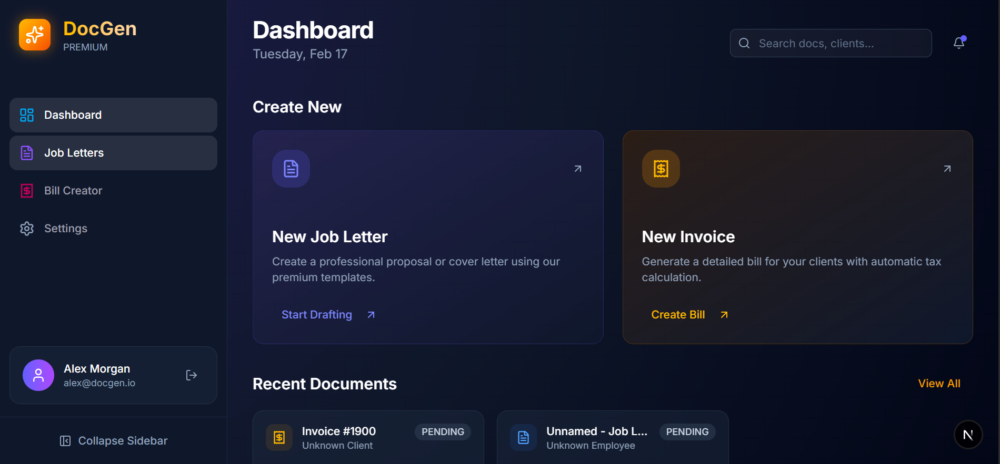

# 📄 Job Letter & Bill Generator

> A modern, professional **Job Letter** and **Invoice/Bill** generator built with Next.js. Create, preview, and download polished PDFs — all from a sleek dark-themed UI.

**If you find this project useful, please consider giving it a ⭐ star on GitHub! It helps others discover it.**

---



---

## ✨ Features

| Feature | Description |
| --- | --- |
| 📝 **Job Letter Creator** | Multi-step form with live preview, salary-in-words, working hours, weekly offs & probation |
| 🧾 **Invoice / Bill Creator** | Bill From/To cards, line items table, delivery charge & auto-calculated totals |
| 📥 **PDF Generation** | Download professional PDFs instantly using jsPDF |
| 🎨 **Template Options** | Classic jewellery (red/yellow themes) or modern e-commerce layouts |
| 📑 **2-in-1 Mode** | Generate duplicate or separate bills on a single page |
| 💾 **Draft Management** | Save, edit & reload drafts from the dashboard |
| ⚙️ **Settings** | Persist company details, manage saved data & clear all drafts |
| 🌙 **Dark Theme** | Premium dark UI with amber accents |

---

## 🚀 Getting Started

```bash
# Clone the repository
git clone https://github.com/your-username/job-and-bill-gen.git
cd job-and-bill-gen

# Install dependencies
npm install

# Run development server
npm run dev
```

Open [http://localhost:3000](http://localhost:3000) in your browser.

---

## 🛠 Tech Stack

| Technology | Purpose |
| --- | --- |
| [Next.js](https://nextjs.org) | App Router framework |
| TypeScript | Type safety |
| Tailwind CSS | Styling |
| Zustand | State management (persisted to localStorage) |
| jsPDF | PDF generation |
| Lucide React | Icons |
| shadcn/ui | UI components |

---

## 📁 Project Structure

```
app/
├── dashboard/       # Dashboard with recent documents
├── invoice/         # Invoice creation page
├── job-letter/      # Job letter creation page
├── settings/        # Company settings & data management
├── store/           # Zustand store
├── types/           # TypeScript interfaces
└── utils/           # PDF generation & utilities
components/
├── ui/              # shadcn/ui components
├── Sidebar.tsx      # App sidebar navigation
├── JobLetterForm.tsx
├── LetterPreview.tsx
└── BillCreator.tsx
```

---

## 🤝 Contributing

Contributions, issues, and feature requests are welcome! Feel free to open an issue or submit a pull request.

## ⭐ Show Your Support

Give a ⭐ if this project helped you! Your support means a lot and motivates continued development.

## 📝 License

MIT © Gaurav Dadhich
